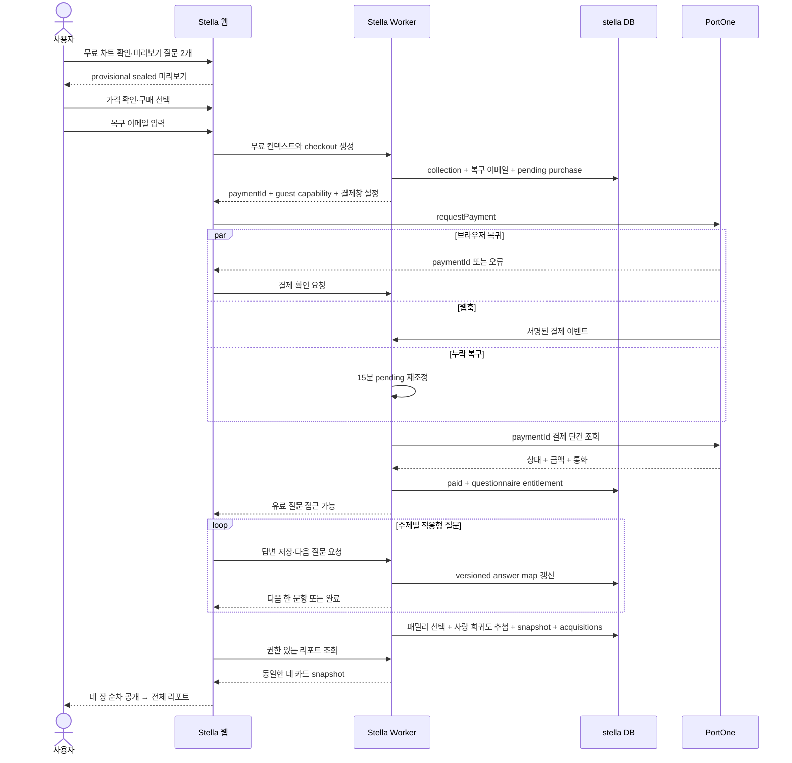

# 한국 전체 리포트 결제·공개 수직 슬라이스

한국 사용자가 무료 출생 차트에서 두 질문으로 수호령 미리보기를 보고, 회원가입 없이 전체
리포트를 결제한 뒤 결제 후 개인화 질문에 답하고 네 장의 카드를 공개하는 첫 유료 수직 흐름의
구현 계약이다.

상품·가격·추첨·계정의 상위 결정은
[유료 카드 리포트 MVP와 확장 전략](./paid-mvp-product-strategy.md), 화면 표현은
[모바일 카드 리포트 프로토타입](./card-report-prototype.md)을 따른다.

## 문서 상태

- 마지막 갱신: 2026-08-01
- 첫 시장과 로케일: `KR`, `ko`
- 첫 SKU: `guardian-report-full-v1`, 3,900원
- 결제 연동: PortOne V2 인증 결제
- 첫 실결제수단: 토스페이 직접 연동 `tosspay_v2`
- 후속 결제수단: 토스페이먼츠는 실결제 승인 뒤 활성화
- 현재 구현: 상품 매니페스트, 추첨, 게스트 컬렉션·리포트·구매·획득·보장 도메인,
  실제 한국어 선택형 질문 44개와 선택 메모 1개, 불변 콘텐츠 계약·DB·게시 CLI·답변별 저장과 현재 문항 계산,
  Turnstile·rate limit을 거치는 guest checkout, PortOne 원격 confirm·서명 웹훅, capability 기반 질문
  GET/PUT과 draft/fulfilled report GET API
- 아직 미연결: 15분 pending 재조정, 실제 DB push·문항 게시, 무료 결과와
  결제·질문·카드 공개 화면의 서버 상태, 이메일 복구 전송
- 이 문서의 범위: 무료 질문 2개 → 분량 안내·복구 이메일 → 결제 → 서버 검증 → 유료 질문 → 카드 공개

## 1. 왜 이 흐름이 다음 작업인가

현재는 카드 화면과 서버 도메인이 각각 존재하지만 실제 매출과 사용 경험을 연결하는 경로가 없다.
계정, 재추첨, 수천 장의 카탈로그를 먼저 확장하면 첫 결제 전환과 카드 공개 경험을 검증하지 못한 채
주변 시스템만 커진다.

첫 수직 슬라이스는 다음 질문에 가장 짧게 답한다.

- 무료 결과를 본 사용자가 미리보기 질문과 3,900원 결제까지 이동하는가
- 결제 후 개인화 질문을 끝내고 네 장을 공개하는 경험이 충분히 강한가
- 카드 공개 뒤 리포트를 끝까지 읽는가
- 결과를 다시 열 수 있는 게스트 접근 방식이 이해되는가
- 서버 검증과 카드 스냅샷이 중복 콜백에도 한 번만 생성되는가

### 포함

- 기존 한국어 무료 출생 차트와 수호령 리포트 제안
- 무료 미리보기 질문 2개와 결제 전 유료 질문 분량·예상 시간 안내
- 결제 직전 필수 게스트 복구 이메일
- 게스트 컬렉션과 서버 가격의 pending 구매
- 전체 리포트 1개 SKU의 서버 가격
- PortOne 결제창과 모바일 리디렉션 복귀
- 브라우저 확인, 웹훅, 재조정의 서버 결제 검증
- 결제 확인 뒤 16~20개의 적응형 선택 질문과 답변별 저장·재개
- 전체 답변 기반 기본 카드 선택
- 결제 후 네 카드의 순차 공개와 전체 웹 리포트
- 같은 브라우저에서 새로고침·재접속했을 때 같은 결과 복구

### 제외

- Stella 계정과 게스트 컬렉션 귀속
- 사랑 카드 재추첨 구매와 보장 카운터 UI
- 카카오 로그인·알림톡
- 중국 본토 결제
- PDF, 공개 공유 페이지, 카드별 댓글
- production 출시용 최소 1,024장 카탈로그와 계절·의상 확장

제외 항목을 위한 별도 임시 모델은 만들지 않는다. 현재 컬렉션, 리포트 스냅샷, 구매, 획득 이력
구조를 그대로 사용하고 이후 경로만 연결한다.

## 2. 권위 경계

다음 원칙은 구현 편의보다 우선한다.

- 브라우저는 무료 차트 계산, 표시된 질문 답변, 결제수단, PortOne 결제창 실행만 담당한다.
- SKU 가격, 통화, 시장, 주문명, 채널 키와 `paymentId`는 서버가 결정한다.
- 유료 질문 원문·선택지·적응형 선택 정책·점수는 Git JSON으로 관리하되 Next 정적 export에는 묶지 않는다.
  서버는 확인된 유료 entitlement에 다음 질문만 전달한다.
- 브라우저의 결제 성공 응답이나 리디렉션 파라미터는 카드 지급 근거가 아니다.
- 서버가 PortOne 결제 조회 결과의 상태, 금액, 통화를 로컬 pending 구매와 비교한다.
- 결제 확인은 paid questionnaire 접근 권한만 연다. 유료 질문이 완료되기 전에는 카드 패밀리나
  에디션을 선택하지 않는다.
- 전체 답변을 받은 뒤 서버가 기본 패밀리를 안정적으로 선택하고 사랑 희귀도를 한 번만 추첨한다.
- 최종 카드 스냅샷·획득 이력 저장은 하나의 DB 트랜잭션이다.
- 브라우저 확인, 웹훅, 재조정은 모두 같은 멱등 구매 확정 함수를 호출한다.
- 결과 화면은 콜백 응답에 들어 있던 임시 카드가 아니라 저장된 리포트 스냅샷을 조회한다.

질문 콘텐츠의 Git source와 런타임 전달 경계, 운영 절차는
[유료 질문 콘텐츠 계약과 게시](./paid-questionnaire-content.md)를 따른다.

PortOne도 인증 결제의 금액 등이 브라우저에서 처리되므로, 성공한 `paymentId`를 서버로 보내 결제
조회 API의 상태와 실제 금액을 검증하도록 요구한다.

- [PortOne V2 인증 결제 연동](https://developers.portone.io/opi/ko/integration/start/v2/checkout)
- [PortOne V2 웹훅 연동](https://developers.portone.io/opi/ko/integration/webhook/readme-v2?v=v2)

## 3. 전체 흐름



동시에 여러 확인 경로가 도착해도 구매 행 잠금과 `entitlementGrantedAt`을 기준으로 유료 질문
접근은 한 번만 열린다. 카드 선택과 추첨은 마지막 답변 처리에서 report 행을 잠그고 한 번만
실행한다. 나머지 호출은 저장된 질문 진행 상태나 최종 결과를 반환한다. PortOne에서 결제는
완료됐지만 DB 트랜잭션이 실패했다면 로컬 구매는 `pending`으로 남고 웹훅이나 재조정이 다시
확정한다.

## 4. API 경계

경로 이름은 구현 시 다음 형태를 기본값으로 사용한다.

| API                                                     | 권한                 | 책임                                                                                 |
| ------------------------------------------------------- | -------------------- | ------------------------------------------------------------------------------------ |
| `POST /api/guardian-checkouts`                          | Turnstile·rate limit | 무료 컨텍스트·이메일 검증, collection·pending 구매 생성·재사용                       |
| `POST /api/guardian-purchases/:paymentId/confirm`       | 게스트 capability    | PortOne 원격 상태 조회, paid entitlement·questionnaire draft 생성                    |
| `POST /api/guardian-webhooks/portone`                   | PortOne 서명         | 이벤트를 검증한 뒤 같은 구매 확정 함수 호출                                          |
| `GET /api/guardian-reports/:reportPublicId`             | 게스트 capability    | 유료 질문 진행 메타데이터 또는 fulfilled 결과 조회                                   |
| `GET /api/guardian-reports/:reportPublicId/question`    | paid capability      | 현재 session에서 허용된 다음 한 문항 조회                                            |
| `PUT /api/guardian-reports/:reportPublicId/answers/:id` | paid capability      | 한 답변 저장, 다음 맞춤 문항 계산, 마지막 답변이면 카드 선택·report fulfillment 수행 |

### 무료 미리보기와 결제 컨텍스트

- 무료 질문 2개의 provisional 미리보기는 브라우저에서 만들고 DB 행이나 capability를 생성하지
  않는다.
- provisional 미리보기는 태양 별자리 수호령과 답변별 로케일 문구만 조합하며 서버의 production
  패밀리 scorer를 브라우저에 복제하지 않는다.
- checkout은 `locale`, 무료 결과에서 이미 계산한 정규화된 차트 핵심값, 무료 답변 ID와 복구
  이메일만 받는다.
- 생년월일·시간·장소를 다시 묻거나 purchase context에 원본 출생 프로필로 저장하지 않는다. 계정 보관을
  선택하는 후속 단계에서만 원본 프로필을 별도로 저장한다.
- 출생 시간을 모르는 결과에는 하우스와 각도 값을 보내지 않는다. 서버는 없는 값을 추정하지 않는다.
- 출생 시간을 모르면 `moonLongitudeRange`를 함께 보내고, 시간을 아는 결과에서는 이 값을 `null`로
  보낸다. 이후 scorer가 정오 달 위치를 확정값으로 오인하지 않게 `timeKnown`도 snapshot에 고정한다.
- 미결제 purchase context는 짧은 보존 기간 뒤 pending 구매와 함께 삭제한다.

### Checkout

- 첫 수직 슬라이스에서는 `guardian-report-full-v1`만 허용한다.
- `market=KR`, `currency=KRW`, `amount=3900`은 저장된 매니페스트에서 읽는다.
- checkout 생성 요청에서 복구 이메일을 필수로 받고 trim과 형식 검증을 적용한다. 전달용 값과
  비교용 소문자 값을 구매에 연결한다.
- 입력란에는 `영수증과 재열람 링크를 보내드려요 · 계정 생성 아님`을 바로 표시한다. 비밀번호,
  전화번호, 마케팅 동의를 함께 요구하지 않는다.
- `paymentId`는 서버가 짧은 ASCII ID로 생성한다. 제품 구분이 가능한 `st_` 접두사를 사용한다.
- 같은 무료 컨텍스트와 collection에 활성 pending 구매가 있으면 새 행을 만들지 않고 기존 checkout을
  돌려준다.
- 아직 결제되지 않은 기존 pending 구매에서는 사용자가 다시 제출한 복구 이메일로 갱신할 수 있다.
  `paid` 이후에는 checkout 재시도로 구매 이메일을 바꾸지 않는다.
- PortOne은 같은 `paymentId`로 여러 결제 시도를 허용하고 최종 성공은 한 번만 허용하므로,
  결제창 이탈 뒤 같은 pending checkout을 다시 열 수 있다.
- 브라우저는 결제창을 열기 전에 `paymentId`, collection capability를 `sessionStorage`에
  저장해 모바일 리디렉션 뒤 복구한다.

신규 `POST /api/guardian-checkouts` 요청은 다음 필드만 받는다.

| 필드             | 계약                                                                    |
| ---------------- | ----------------------------------------------------------------------- |
| `locale`         | 현재는 `ko`만 허용                                                      |
| `chart`          | `timeKnown`, 정규화된 행성 경도, 각도·하우스, 시간 미상 시 달 경도 범위 |
| `previewAnswers` | `tone`, `movement`의 공개 선택지 ID                                     |
| `email`          | trim·형식·254자 제한을 통과한 복구 이메일                               |
| `turnstileToken` | action이 `guardian-checkout`인 solve                                    |

`chart.planets`는 태양~명왕성, 남·북노드, 릴리트, 키론을 모두 포함하고 출생 시간을 아는
경우에만 포르투나를 추가한다. 모든 경도는 `[0, 360)`이며 행성 ID는 중복될 수 없다.

기존 checkout 재개 요청은 같은 endpoint에 `reportPublicId`, 새 `email`, `turnstileToken`만 보내고
collection capability를 `Authorization: Bearer`로 전달한다. active `pending`이면 같은 `paymentId`를
반환하며 이메일만 갱신하고, `paid`이면 이메일을 바꾸지 않는다. 이전 구매가 `failed` 또는
`cancelled`이고 report가 아직 draft면 같은 report에 새 pending 구매를 만든다.

신규 응답은 `guest.{collectionPublicId,reportPublicId,accessToken}`과
`payment.{paymentId,status,sku,storeId,channelKey,payMethod,orderName,amount,market,currency,noticeUrls}`로 나눈다.
재개 응답은 이미 Authorization으로 보낸 capability를 다시 싣지 않는다. 신규는 `201`, 재개는
`200`이며 `payment.status`가 `pending`일 때만 브라우저가 결제창을 연다.
가격과 PortOne 채널은 요청에서 받지 않고 매니페스트와 배포별 channel map에서만 정한다.

### Confirm과 리포트 조회

- confirm은 브라우저가 보낸 금액·통화·성공 여부를 사용하지 않는다.
- capability가 해당 collection과 purchase에 연결되는지 먼저 확인한다.
- 원격 상태가 `PAID`일 때만 로컬 구매와 금액·통화를 비교하고 유료 질문 entitlement를 지급한다.
- 처리 중이거나 PortOne 조회가 일시 실패하면 `pending`을 유지한다.
- PortOne에 결제가 아직 없거나 `READY`·`PAY_PENDING`이면 confirm은 `202`와 `pending`을 반환한다.
  명시적 실패·취소·환불은 로컬 구매 상태를 수렴한 뒤 `200`으로 그 상태를 반환한다.
- 금액·통화 불일치는 `review_required`로 고정하고 `409`를 반환해 같은 불일치를 무한 재조회하지 않는다.
- 질문 진행과 카드 공개 데이터는 confirm의 일회성 응답에만 의존하지 않는다. confirm 뒤 리포트 조회 API를
  호출해 새로고침, 웹훅 선착, 지연 완료가 모두 같은 UI 경로를 사용한다.
- draft 응답에는 질문 진행률만 포함하고 전체 질문 은행, `familySnapshot`, `cardSnapshot`,
  선택된 희귀도를 포함하지 않는다.
- fulfilled 응답만 네 `cardEditionId`, 카드 표시 메타데이터, 리포트 문구 버전을 제공한다.
- fulfilled 카드에는 `cardEditionId`, `familyId`, `slot`, `rarity`, `artworkPath`, `messageKey`만
  포함한다. 리포트 입력 snapshot, 답변, 누적 signal과 family snapshot은 반환하지 않는다.

### 유료 질문 HTTP 계약

- 두 API 모두 `Authorization: Bearer <collection capability>`를 요구하며 URL의 `reportPublicId`가
  같은 collection 소유인지 한 DB 조인으로 확인한다.
- `GET .../question`은 `{ "step": ... }`만 반환한다. step은 현재 한 문항, 선택 메모, 완료 중
  하나이며 전체 문항 은행·선택 점수·누적 signal은 내려보내지 않는다.
- `PUT .../answers/:id`는 선택형에 `{ "answer": { "type": "option", "optionId": "..." } }`,
  선택 메모에 `{ "answer": { "type": "text", "text": "..." } }`를 받는다. 메모 건너뛰기는
  `text: null`이다.
- 성공 응답은 `{ "saved": "saved|already-saved", "step": ... }`다. 같은 답변 재전송은 멱등이고,
  이미 지난 문항을 다른 값으로 바꾸면 `409`, entitlement 전에는 `402`를 반환한다.
- 마지막 step 저장은 별도 공개 endpoint를 거치지 않고 답변 snapshot·signal snapshot·네 카드 선택·
  acquisition 기록·report fulfillment를 기존 한 트랜잭션에서 끝낸다.

### 출시 선택 규칙 권장안

현재 두 질문은 무료 미리보기용으로 유지한다. 결제 후에는 네 주제마다 핵심 맥락 3개와 누적
답변으로 고른 필수 맞춤 질문 1개를 묻는다. 관련도 기준을 넘긴 주제에 심화 질문을 하나씩 더해
전체 16~20개를 제공한다. 필수 문항은 모두 선택지 기반이며 자유 입력은 진행률이 끝난 뒤 별도
선택 메모로 최대 한 개만 제공한다. 실제 문구, 선택지, 선택 정책과 점수 행렬은 versioned JSON에 둔다.

| 슬롯     | 차트의 주축                             | 유료 질문의 구조적 역할         |
| -------- | --------------------------------------- | ------------------------------- |
| 자기이해 | 태양 별자리, 달·상승궁은 보조           | 현재 맥락·바라는 변화·반복 패턴 |
| 사랑     | 금성, 신뢰 가능한 경우 디센던트·7하우스 | 관계 맥락·바라는 변화·반복 패턴 |
| 일       | 신뢰 가능한 경우 중천점, 토성·10하우스  | 업무 맥락·바라는 변화·제약      |
| 결정     | 수성, 화성                              | 선택 맥락·우선순위·제약         |

- 자기이해는 사용자의 태양 별자리 캐릭터를 반드시 선택한다.
- 유료 MVP는 자기이해·사랑·일·결정 각 한 패밀리, 총 4개 패밀리·7개 에디션만 게시한다. 네
  family pool의 후보가 각각 하나이므로 입력은 MVP 패밀리를 바꾸지 않는다.
- 차트 관련성을 기본 축으로 두고 결제 후 주제 답변을 무료 공통 답변보다 강하게 반영한다. 정확한
  점수 행렬은 questionnaire Git version과 함께 서버 콘텐츠로 게시한다.
- 16~20개의 선택 답변은 네 주제 상세 리포트 본문, 섹션별 해석 초점, 전체 요약과 한 줄을 실질적으로
  바꾼다. 선택 자유 입력을 작성했다면 본문 보조 맥락으로만 사용하고 미작성은 완료를 막지 않는다.
- 자기이해 유료 답변은 태양 별자리 패밀리를 바꾸지 않고 장면·한 줄·해석의 초점을 바꾼다.
- 하나의 보편적인 `위로=물` 매핑을 모든 슬롯에 재사용하지 않는다. 같은 답도 사랑, 일, 결정에서
  다른 친화도를 갖는 작은 슬롯별 행렬로 관리한다.
- 동일 점수는 `selectionRuleVersion`과 정규화 입력의 안정적인 hash로 해소한다. 같은 입력의
  재시도는 같은 패밀리가 나오고 임의 새로고침으로 카드를 탐색할 수 없다.
- production에서 후보가 추가되면 답변은 기본 패밀리와 원화에도 실제 영향을 주지만, 답 하나를
  바꿀 때마다 네 장 모두 바뀐다고 약속하지 않는다.
- 기본 패밀리 선택과 사랑 희귀도 추첨을 분리한다. 답변, 별자리, 출생 정확도는 희귀도 확률을
  올리거나 내리지 않는다.

유료 MVP는 4개 패밀리·7개 에디션을 같은 매니페스트에 게시한다. production 출시에는 실제 3:4
에디션을 최소 1,024장 게시하며 상세 제작 원칙은
[카드 카탈로그](./card-catalog.md)를 따른다.

## 5. 상태와 멱등성

### 리포트

```text
draft ── 유료 질문 완료 + 카드 선택 ──> fulfilled
```

report draft는 checkout에서 pending 구매와 함께 만들어 questionnaire version과 무료 입력
snapshot을 먼저 고정한다. 결제 확인 전에는 질문을 읽을 권한이 없고, 확인 뒤 같은 draft에 유료
질문 진행 상태를 저장한다. 별도의 `awaiting_questions` 상태를 추가하지 않는다. fulfilled
리포트는 현재 규칙으로 다시 계산하지 않는다.

### 구매

```text
pending ── PAID + 일치 ───────────────> paid
pending ── 명시적 실패·취소 ─────────> failed | cancelled
pending ── 금액·통화 불일치 ─────────> review_required
paid ───── 환불 확인 ────────────────> refunded
```

- `paid` 전환과 유료 질문 entitlement 지급은 같은 트랜잭션이므로 둘 중 하나만 성공한 상태를
  만들지 않는다. 카드 지급은 유료 질문 완료 시 별도 report 트랜잭션으로 수행한다.
- `review_required`는 카드를 지급하지 않고 운영 알림을 보낸다. 계속 `pending`으로 두고 매번
  재조정하면 같은 불일치를 무한 조회하게 되므로 별도 상태가 필요하다.
- `paymentId` unique, full-report의 활성 구매 unique, 구매의 entitlement timestamp, 최초 슬롯별
  acquisition unique를 함께 사용한다.
- PortOne 웹훅의 `webhook-id`도 별도 이벤트 테이블에서 unique로 기록한다.
- 이미 지급된 구매를 다시 확인하면 새로운 난수 추첨이 아니라 저장된 스냅샷을 반환한다.

## 6. PortOne 연결 기준

### 브라우저와 서버

- 브라우저는 `@portone/browser-sdk/v2`의 `requestPayment`를 사용한다.
- 첫 실결제 채널은 승인된 토스페이 직접 연동 `tosspay_v2`로 고정하고 `payMethod: "EASY_PAY"`를
  사용한다.
- 승인 중인 토스페이먼츠 결제창은 첫 흐름에 조건부 분기로 넣지 않는다. 실결제 승인이 끝나면
  `CARD` 등의 결제수단과 channel key를 서버 channel map에 추가한다.
- 모바일을 포함하므로 `redirectUrl`을 항상 제공하고 반환값 방식과 리디렉션 방식을 모두 처리한다.
- `storeId`와 `channelKey`는 공개 설정이지만 클라이언트가 임의로 고르는 값은 받지 않는다. 서버가
  허용한 결제수단에 대응하는 한 채널만 checkout 응답으로 보낸다.
- API Secret과 Webhook Secret은 Stella 전용 Worker binding으로만 읽고 브라우저 번들·응답·로그에
  넣지 않는다.
- 대표 Store의 콘솔 기본 웹훅은 다른 제품도 사용하므로 Stella checkout은 배포별 고정
  `STELLA_PUBLIC_ORIGIN`으로 만든 `/api/guardian-webhooks/portone`을 `noticeUrls`로 반환한다. 브라우저는
  이 값을 결제 요청에 그대로 전달해 Store 기본 URL을 Stella 결제에 한해서 덮어쓴다.
- PortOne 어댑터는 Stella Worker 호출부 가까이에 두고 Vibe 결제 테이블이나 계정을 공유하지 않는다.

### 웹훅과 재조정

- 웹훅 버전은 현재 최신인 `2024-04-25`를 사용한다.
- JSON 파싱 전에 raw body와 `webhook-id`, `webhook-signature`, `webhook-timestamp`로 서명을
  검증한다.
- 서명된 `Transaction.Paid` 이벤트도 지급 근거로 바로 사용하지 않고 PortOne 결제 단건 조회를
  실행한다.
- 유효한 웹훅은 이미 처리된 이벤트나 관심 없는 이벤트여도 2xx로 응답한다.
- 처리 완료된 Stella 결제 이벤트만 `webhook-id`, type, `paymentId`로 기록한다. raw payload는 저장하지
  않으며 일시 실패는 이벤트 행을 남기지 않아 PortOne 재시도를 허용한다. 완료 이벤트 행은 90일 뒤
  일일 purge에서 정리한다.
- 15분 이상 `pending`인 구매는 별도 cron이 제한된 batch로 재조회한다.
- 결제 확인 경로는 웹훅 누락과 브라우저 이탈을 서로 보완해야 하며 어느 하나만 필수 경로가 되지
  않게 한다. PortOne도 브라우저 응답 유실에 대비해 웹훅 사용을 강하게 권장한다.

### 설정 경계

Stella에 다음 설정이 필요하다.

| 종류          | 이름                                   |
| ------------- | -------------------------------------- |
| plain var     | `STELLA_PORTONE_STORE_ID`              |
| plain var     | 허용 결제수단별 Stella channel key map |
| plain var     | `STELLA_PUBLIC_ORIGIN`                 |
| Secrets Store | `STELLA_PORTONE_API_SECRET`            |
| Secrets Store | `STELLA_PORTONE_WEBHOOK_SECRET`        |

PortOne의 Store ID는 상점을 식별하고 channel key는 실제 PG 연결을 선택한다. API Secret은 결제
거래를 제어하므로 서버에만 둔다.

`STELLA_PORTONE_API_SECRET`에는 PG 채널 설정의 API key·secret key·client key가 아니라 PortOne
연동 정보에서 별도로 발급한 **V2 API Secret**을 넣는다. 이 값은 Store 범위라 test/live 조회에 함께
사용하고, `STELLA_PORTONE_WEBHOOK_SECRET`은 PortOne 설정 모드별로 발급한 live/staging 값을 각각
바인딩한다.

- [PortOne 결제 연동 준비](https://developers.portone.io/opi/ko/integration/ready/readme)
- [PortOne 연동 정보와 채널 관리](https://developers.portone.io/opi/ko/console/guide/channel-manage)
- [PortOne V2 토스페이](https://developers.portone.io/opi/ko/integration/pg/v2/tosspay-v2?v=v2)

## 7. 게스트 접근과 복구

- 256-bit collection capability 원문은 브라우저에 한 번만 반환하고 DB에는 SHA-256 digest만 둔다.
- API에서는 `Authorization: Bearer`로 전달한다. URL, 쿼리 문자열, analytics, 오류 로그에 넣지 않는다.
- 같은 기기의 결제 복귀에는 `sessionStorage`를 사용한다. `localStorage`의 프로토타입 컬렉션은
  서버 소유권으로 대체한다.
- 결제 완료와 카드 공개 사이에 회원가입을 요구하지 않는다.
- 계정을 만들면 기존 collection 행을 계정에 연결하고 guest capability를 폐기한다.

### 확정된 이메일 복구

한국 게스트 checkout에서는 이메일을 필수 복구 채널로 받되 “회원가입”이 아니라 영수증과 구매
복구 용도임을 입력 시점에 명확히 표시한다.

- 한 번만 입력받고 `type="email"`, `autocomplete="email"`을 사용한다. 확인용 재입력이나 결제 전
  이메일 OTP 인증은 요구하지 않는다.
- 전화번호와 카카오톡 수신은 첫 결제 필수값으로 두지 않는다.
- 메일 발송 실패가 결제 확정이나 카드 공개 트랜잭션을 되돌리면 안 된다.
- 재열람 메일은 장기 collection capability를 그대로 URL에 넣지 않고, 짧은 만료 시간과 1회성을
  가진 교환 토큰으로 새 접근을 발급한다.
- 이메일 정규화 값과 전달 상태는 구매 복구에 필요한 범위에서 구매와 연결한다.

## 8. 무료 결과에서 결제로 이어지는 화면

기존 무료 출생 차트의 Big 3, 차트 휠, 세부 해석, 원소·각·패턴·장문 리포트를 삭제하거나 중간에서
잠그지 않는다. 유료 상품은 기존 무료 문장의 잠금 해제가 아니라 네 수호령 원화, 질문을 반영한
교차 주제 해석, 구매 스냅샷, 컬렉션 보관을 제공하는 별도 경험이어야 한다.

### 제안 위치

- 주 제안은 현재 `ConstellationActions` 다음, `ElementBalance` 앞에 한 번 배치한다. 사용자가 무료
  차트와 공유 기능까지 확인한 가치 순간 뒤이고, 긴 세부 분석을 읽기 전에 발견할 수 있는 경계다.
- 무료 장문 리포트 끝에는 작은 텍스트 CTA를 한 번 더 둔다.
- 최초 버전에는 전역 팝업과 계속 따라오는 sticky CTA를 넣지 않는다. 두 위치의 전환을 먼저 본다.
- 다른 사람의 공유 차트에서는 그 사람의 입력으로 유료 draft를 만들지 않는다. 자신의 무료 차트
  만들기로 이어간 뒤 본인 차트를 만든 사용자에게 제안한다.

### 제안 카드

완성 원화 3장을 작은 부채꼴로 보여주되 `카드 예시`라고 표시한다. 희귀도나 실제 당첨 카드처럼
보이게 하지 않는다. 첫 카피안은 다음과 같다.

```text
네 차트에 숨어 있는 네 수호령을 만나봐
두 가지 선택으로 먼저 방향을 보고, 결제 후 정밀 질문으로 네 카드를 찾아요.
[내 수호령 찾기 · 약 20초]
```

- CTA를 누른 뒤 현재 프로토타입의 두 질문을 같은 자리에서 단계적으로 보여준다.
- 무료 답을 마치면 DB를 쓰지 않고 `자기이해`, `사랑`, `일`, `결정` 이름이 붙은 카드 뒷면 네
  장과 한 줄 provisional teaser를 보여준다. `미리 본 방향`이라고 표시해 최종 카드가 정해졌다고
  말하지 않는다.
- 자기이해 카드 뒷면에는 무료 차트에서 이미 알 수 있는 태양 별자리 수호령이 얼굴만 내밀게 해
  실제 개인화임을 증명한다. 나머지 세 장은 원소 빛과 주제 키워드까지만 보여준다.
- teaser는 `네 리포트에는 시작하려는 마음과 지키려는 마음이 함께 보여요`처럼 입력을 반영한
  종합 방향만 말한다. 정확한 카드 패밀리, 제목, 장면 원화, 사랑 희귀도는 공개하지 않는다.
- sealed 미리보기 아래에서 원화 네 장, 주제별 해석, 전체 요약, 구매 후 재열람이 포함된다는
  납품물을 짧게 열거한다.
- 구매 CTA는 가격을 버튼 안에 포함한다:
  `네 카드와 전체 리포트 열기 · 3,900원`.
- 구매 CTA를 누르면 유료 질문 원문 대신 `결제 후 16~20개 · 네 주제 · 약 4~7분 · 중간 저장`
  안내와 납품물을 보여준다.
- 같은 checkout sheet에서 복구 이메일을 받은 뒤 토스페이로 이동한다. 결제가 확인되면
  자기이해·사랑·일·결정 질문을 한 화면에 하나씩 제공하고 진행률, 뒤로 가기, 선택 수정을 지원한다.
- 희귀도 확률과 미보유 보장 설명은 CTA 가까이에서 한 번에 열 수 있게 하고, 질문 응답이 희귀도
  확률을 바꾸지 않는다고 명시한다.

### Checkout과 공개

provisional 미리보기 뒤 한 화면짜리 checkout sheet를 열고 질문 분량과 결과물을 안내한다.
이메일을 입력한 다음 토스페이로 이동하며 계정, 비밀번호, 전화번호는 요구하지 않는다.

```text
freeResult
  → previewQuestions
  → provisionalPreview
  → checkoutDetails
  → checkoutEmail
  → checkoutCreating
  → paymentOpen
  → verifying
  → paidQuestionnaire
  → fulfilling
  → reveal
  → report
```

- 무료 질문 진행 상태는 checkout 전까지 `sessionStorage`에만 둔다. 유료 질문 답변은 매 문항
  서버 draft에 저장해 기기 이탈 뒤에도 복구한다.
- report 공개 참조와 capability는 URL에 함께 싣지 않고 `sessionStorage`로 `/[locale]/cards`
  화면에 넘긴다. 이메일 재열람은 짧은 교환 토큰으로 새 capability를 발급한다.
- `drawPrototypeRarity()`는 제거하고 fulfilled API의 카드 스냅샷만 사용한다.
- `?rarity=`로 전체 유료 리포트를 여는 동작은 제거한다. 공유 미리보기는 별도 공개 결과 계약으로
  나중에 만든다.
- `verifying`은 오류 화면이 아니라 결제 상태를 맞추는 정상 단계다.
- 일시적인 `pending`이면 짧게 재조회하고, 이후에는 같은 브라우저에서 다시 확인할 수 있는 복구
  화면을 제공한다.
- 이미 paid이고 draft라면 저장된 다음 유료 질문으로, fulfilled라면 저장된 네 카드 공개 흐름으로
  진입한다.
- 기존 3D 카드 뒤집기, reduced motion, 네 섹션 완독 진행률은 유지한다.
- Stella 계정 보관 제안은 네 카드와 요약을 공개한 뒤에만 보여준다.

## 9. 관측과 운영

| 이벤트                                 | 기록 시점                                                  |
| -------------------------------------- | ---------------------------------------------------------- |
| `guardian_offer_view`                  | 무료 결과의 주 제안이 viewport에 처음 들어왔을 때          |
| `guardian_offer_start`                 | 사용자가 `내 수호령 찾기`를 눌렀을 때                      |
| `guardian_preview_answers_complete`    | 무료 답변 2개가 모두 선택됐을 때                           |
| `guardian_provisional_preview_view`    | 브라우저 provisional 미리보기가 표시됐을 때                |
| `guardian_checkout_view`               | 질문 분량과 이메일 checkout sheet가 표시됐을 때            |
| `guardian_checkout_start`              | 서버 pending 구매가 만들어졌을 때                          |
| `guardian_purchase_complete`           | 서버가 원격 결제를 확인하고 entitlement를 처음 지급했을 때 |
| `guardian_paid_questionnaire_start`    | 결제 확인 뒤 첫 유료 질문이 표시됐을 때                    |
| `guardian_paid_questionnaire_complete` | 유료 질문이 모두 저장됐을 때                               |
| `guardian_report_fulfilled`            | 서버가 카드 네 장을 처음 고정했을 때                       |
| `guardian_card_reveal`                 | 사용자가 실제 카드 앞면을 열었을 때                        |
| `guardian_report_complete`             | 네 섹션을 모두 읽었을 때                                   |

`guardian_purchase_complete`는 브라우저와 웹훅 양쪽에서 중복 기록하지 않고 구매 확정 함수가
처음 이긴 시점에 한 번만 기록한다.

무료 결과 방문자를 분모로 제안 노출 → 무료 질문 완료 → checkout → 결제 → 유료 질문 시작·완료 →
첫 카드 공개 → 완독의 이탈을 본다. 특히 결제 완료 대비 질문 완료율과 평균 완료 시간을 따로 봐서
결제 후 질문의 풍부함이 결과 공개를 과도하게 늦추지 않는지 확인한다. 매출만 보지 않고
`무료 결과 방문당 매출`, 구매 후 카드 공개율, 완독률, 7일 재열람률을 함께 본다.

운영 알림 대상은 금액·통화 불일치, 동일 구매의 반복 확정 실패, 오래된 pending backlog,
PortOne API·웹훅 시크릿 설정 오류다. capability, 출생 입력, 질문 답변, 전체 결제 응답은 로그에
남기지 않는다.

Stella API에도 request ID, 일관된 problem 응답, secure headers, 전역 오류 처리를 적용해 결제
오류를 HTML 예외나 원문 스택으로 반환하지 않는다.

## 10. 인프라와 배포 경계

- `stella-stg`와 `stella`는 별도 Worker 배포와 PortOne test/live channel map을 사용한다.
- Supabase 프로젝트와 Postgres 데이터베이스는 하나만 사용한다.
- 두 Worker가 기존 제품 단위 `stella` Hyperdrive config 하나를 그대로 공유한다.
- entitlement와 collection의 read-after-write가 필요하므로 Hyperdrive 캐시는 계속 끈다.
- 별도 Hyperdrive, DB role, Supabase 프로젝트를 만들지 않는다.
- 확정 데이터 경계는 같은 DB 안의 `stella_stg`와 `stella` PostgreSQL schema다. staging과
  production이 같은 테이블을 쓰며 행마다 `environment`를 검사하는 구조는 사용하지 않는다.
- `STELLA_DB_SCHEMA`를 build-time에 schema-qualified SQL로 굽고 production fallback을 두지 않는다.
- `stella_app` role은 두 schema의 table·sequence default privilege를 가지되 `search_path`는
  `pg_catalog`만 사용한다.
- `sobok-ops`에는 `stella_stg` schema·grant, Stella PortOne Secrets Store 항목과 필요한 plain
  var만 추가한다. Hyperdrive resource는 추가하지 않는다.
- 유료 질문 은행도 별도 데이터베이스를 만들지 않고 Git 원본을 각 Stella schema의 서버 콘텐츠
  테이블에 게시한다.
- 실제 DB 반영은 앱 코드와 운영 binding이 준비된 뒤 같은 DB에 `drizzle-kit push`를
  `stella_stg`, `stella` 순서로 각각 수행한다.
- Worker cron은 기존 일일 purge와 15분 결제 재조정을 `event.cron`으로 분기한다.

## 11. 권장 구현 순서

1. **완료:** Stella 전용 PortOne 어댑터, API·webhook 비밀 binding, 웹훅 이벤트 데이터를 만든다.
2. **완료:** confirm·webhook·report read API를 현재 guest checkout·paid questionnaire API에 연결한다.
3. 무료 결과의 두 질문·provisional 미리보기와 결제 뒤 질문·fulfillment 화면을 연결한다.
4. pending 재조정과 미결제 checkout context 정리 cron을 연결한다.
5. `/ko/cards`의 클라이언트 난수·로컬 소유권을 서버 상태로 교체한다.
6. `sobok-ops`에 PortOne Store ID, channel map, API/Webhook Secret binding을 반영한다.
7. 두 schema에 Drizzle 선언과 같은 questionnaire version을 게시한다.
8. staging Worker와 PortOne 테스트 채널에서 결제·모바일 리디렉션·질문 재개·카드 공개를 확인한
   뒤 production을 배포한다.

### 완료 기준

- 기존 무료 결과는 결제하지 않아도 끝까지 읽을 수 있다.
- 공유받은 타인의 차트에서는 checkout을 만들 수 없고 자신의 무료 차트 생성으로 이어진다.
- 무료 질문 2개만 끝낸 사용자는 DB draft나 guest collection을 만들지 않는다.
- 결제 전에 유료 질문의 범위와 예상 시간은 보이지만 원문·선택지·선택 정책은 내려오지 않는다.
- 서버가 결제를 확인하면 계정 생성 없이 유료 질문을 시작하고 답변마다 진행 상태가 저장된다.
- 유료 질문을 모두 완료해야 기본 패밀리와 카드 에디션이 한 번만 선택된다. MVP의 단일 후보
  풀도 production과 같은 선택 함수를 통과한다.
- 결제 후 브라우저를 닫아도 복구 이메일로 남은 질문부터 이어서 할 수 있다.
- 같은 정규화 입력과 규칙 버전은 같은 기본 패밀리를 선택한다.
- 질문 답변은 상세 리포트 본문과 한 줄을 실질적으로 바꾸고, production 후보가 늘어나면 기본
  패밀리와 원화에도 영향을 주지만 사랑 희귀도 확률은 바꾸지 않는다.
- checkout은 복구 이메일을 요구하되 계정·비밀번호·전화번호를 요구하지 않는다.
- 결제 전 응답에는 선택된 기본 패밀리 ID, 사랑 희귀도, 카드 앞면 원화가 나타나지 않는다.
- 변조한 브라우저 성공 응답이나 금액으로 카드를 받을 수 없다.
- 브라우저 confirm과 같은 웹훅이 동시에 도착해도 paid entitlement와 구매 완료 이벤트가 한 번만 생긴다.
- 마지막 답변이 중복 제출돼도 카드 네 장과 획득 이력이 한 번만 생긴다.
- 결제 뒤 새로고침해도 같은 질문 진행 상태 또는 같은 네 카드와 리포트를 읽는다.
- 브라우저가 닫혀도 웹훅·재조정으로 구매가 paid에 수렴한다.
- 결제창을 중복 클릭해도 활성 전체 리포트 구매와 카드 스냅샷이 중복 생성되지 않는다.
- PortOne API/Webhook Secret은 Worker 외부로 노출되지 않는다.
- 카드 공개부터 네 섹션 완독까지 기존 접근성과 reduced-motion 동작이 유지된다.
- `stella-stg`와 `stella`는 같은 Hyperdrive ID를 사용하면서 각각 `stella_stg`, `stella` schema만
  명시적으로 조회한다.

## 12. 구현 전에 필요한 제품·운영 결정

| 결정               | 상태·권장안                                                | 이유                                                      |
| ------------------ | ---------------------------------------------------------- | --------------------------------------------------------- |
| 한국 PortOne Store | 기존 대표 Store 사용으로 확정                              | 같은 사업·정산 경계의 앱을 Store 이름만으로 나누지 않는다 |
| 첫 실결제수단      | 토스페이 `tosspay_v2`·`EASY_PAY`로 확정                    | 실결제 승인이 완료된 가장 작은 채널부터 연다              |
| 토스페이먼츠       | 실결제 승인 뒤 channel map에 추가                          | 승인 전 분기를 production UI에 노출하지 않는다            |
| test/live 배포     | `stella-stg`와 `stella` 분리로 확정                        | test channel이 production에서 선택되지 않게 한다          |
| DB·Hyperdrive      | 같은 Supabase DB·같은 Hyperdrive 공유로 확정               | Free plan 자원과 연결 풀을 늘리지 않는다                  |
| DB 내부 경계       | 같은 DB의 `stella_stg`·`stella` schema 분리 확정           | 행별 환경 필터 없이 테스트 데이터를 분리한다              |
| 게스트 이메일      | 결제 직전 필수, 계정 생성과 분리로 확정                    | 결제 후 기기 이탈에도 구매를 복구한다                     |
| 질문 단계          | 무료 2개, 서버 결제 확인 뒤 유료 질문으로 확정             | 앱에서는 paid entitlement 뒤에만 유료 문항을 제공한다     |
| 유료 질문 분량     | 주제별 핵심 3개+필수 맞춤 1개+심화 0~1개, 전체 16~20개     | 모든 주제의 깊이와 구매 후 완료율을 함께 관리한다         |
| 자유 입력          | 질문 수 밖의 선택 메모 최대 1개로 확정                     | 표현 여지는 주되 카드 공개를 지연시키지 않는다            |
| 유료 질문 저장     | Git JSON을 같은 환경 schema의 불변 콘텐츠 행으로 게시      | 배포 재현성과 report별 version 고정을 함께 얻는다         |
| 출시 카드 선택     | MVP 단일 후보, production은 전체 입력으로 패밀리 변경      | 같은 계약에서 후보만 늘린다                               |
| 선택 점수          | 차트 중심, 유료 주제 답변은 무료 공통 답변보다 강하게 반영 | 관련성과 유료 개인화를 함께 확보한다                      |
| MVP 카드 수        | 4개 패밀리·7개 실제 에디션으로 확정                        | 현재 완성 원화로 가장 작은 유료 흐름을 검증한다           |
| production 카드 수 | 실제 게시 에디션 최소 1,024장으로 확정                     | 검수된 원화만 실제 카드 수로 센다                         |
| 무료 결과 제안     | actions 뒤 주 제안과 장문 리포트 끝 보조 CTA 권장          | 무료 가치를 먼저 준 뒤 두 번만 자연스럽게 발견시킨다      |
| 출생 입력          | 기존 무료 차트 핵심값 재사용, 추가 재입력 없음 권장        | 구매 전 중복 입력을 없앤다                                |

다음 제품 결정은 장기 문항은행의 제작 범위와 production 1,024장의 제작 매트릭스다.
토스페이 live channel key는 production 연결 전에 추가로 필요하다. PortOne API
Secret과 test/live Webhook Secret은 채팅이나 public repository에 전달하지 않고 Secrets Store에
넣는다. 유료 질문 원문은 Git의 questionnaire source 디렉터리에 커밋한 뒤 게시 CLI로 DB에 반영한다.
